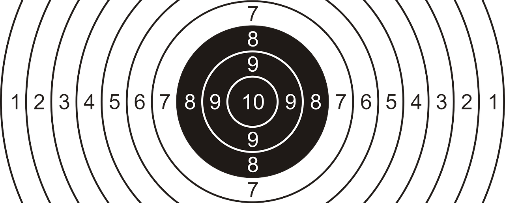

# ShooterLink

### :construction: Application under construction!

ShooterLink is a web application designed to support management and cooperation in sport shooting
clubs. It is meant to be a hub between athletes, trainers and club administration.

## Tech stack

## Features

:clipboard: - planned   :construction: - working on it   :heavy_check_mark: - done    
:clipboard: Athlete profile :clipboard: Personal and club records :clipboard: Traning tracker and
planner :clipboard: Events calendar :clipboard: Competition organization :clipboard: Notification
panel :clipboard: Communication panel :clipboard: Shooting range availability :clipboard: Trainings
calendar

## How to run

1. Clone repository
2. Go to ShooterLink.Web folder
3. Install dependencies  `npm i`
4. Go to ShooterLink.API/Source folder
5. Run application  `dotnet run`

  

### Attributions

[Target icons created by Freepik - Flaticon](https://www.flaticon.com/free-icons/target)
